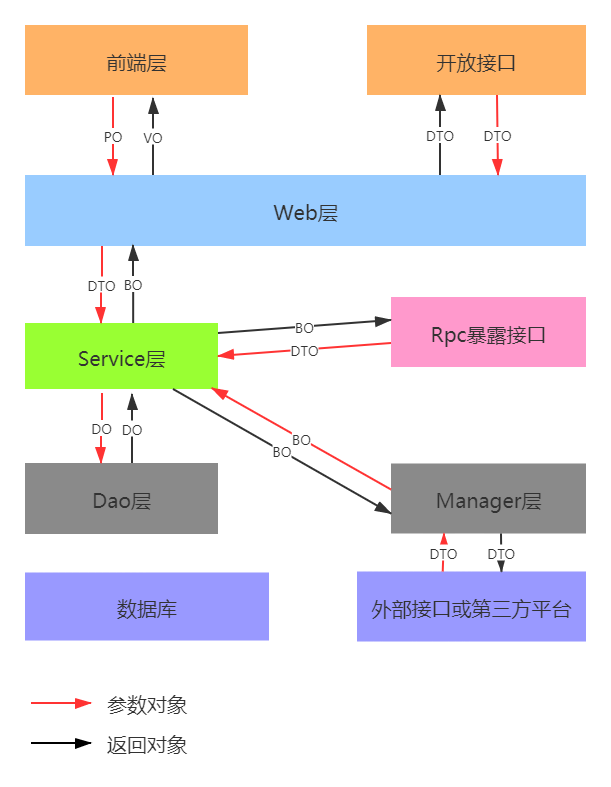

# cy-ruoyi
基于Ruoyi重构的分布式电商系统

--- 
##基础框架
SpringCloud Alibaba + Dubbo + MybatisPlus

---
## 中间件
* 数据库：Mysql
* 网关：Soul
* 缓存数据库：Redis
* 注册中心：Nacos
* 配置中心：Nacos（尚未）
* 限流熔断：Sentinel
* 消息队列：RocketMQ（尚未）
* 分布式事务：Seata（尚未）
* 分布式调用链：SkyWalking
* 分库分表：ShardingSphere（尚未）
* 分布式任务调度：XXL-Job
* 日志收集：Filebeat、Logstash、Kibana
* 搜索引擎：Elasticsearch
* 工作流：Activiti
* 容器：Docker
* 监控体系：Prometheus、Grafana、Druid
* Java诊断：Arthas
* 服务治理：Moss（尚未）
* 认证中心：OAuth2 （尚未）

---
## 服务端地址：
* Nacos Console：localhost:8848/nacos
* Sentinel Console：localhost:8844
* XXL-Admin Console：localhost:7080
* SkyWalking UI：localhost:18080
* Kibana UI：localhost:5601
* RocketMQ Console：localhost:9899（尚未）
* Grafana UI：localhost:3000
* Soul Admin：localhost:9095

---
##  系统架构设计图


---
##  业务架构设计图


---
##  应用分层设计


---
## 目录结构
```
cy-ruoyi
 ├──docs //文件
    ├──poms //相关依赖
 ├──ruoyi-common //通用依赖
    ├──ruoyi-common-core //核心框架
    ├──ruoyi-common-redis //redis通用
    ├──ruoyi-common-log //日志通用
    ├──ruoyi-common-pay //支付通用（尚未）
    ├──ruoyi-common-utils // 工具通用
    ├──ruoyi-common-auth // 授权通用
    ├──ruoyi-common-sms // 消息推送通用
    ├──ruoyi-common-job // 定时任务核心依赖
    ├──ruoyi-common-mq // 消息队列通用
    ├──ruoyi-common-sql // 持久化框架
 ├──ruoyi-demo //Demo 
    ├──ruoyi-demo-provider //provider demo 7070
        ├──ruoyi-provider-api //api
        ├──ruoyi-provider-impl //impl
        ├──ruoyi-provider-app //app
    ├──ruoyi-demo-consumer //consumer demo 7075
        ├──ruoyi-consumer-api //api
        ├──ruoyi-consumer-impl //impl
        ├──ruoyi-consumer-app //app
 ├──ruoyi-quartz // 定时任务
    ├──ruoyi-quartz-admin //job调度中心  7080
    ├──ruoyi-quartz-executor //job执行器  8011
    ├──sql //quartz sql
 ├──ruoyi-soul-gateway // 网关服务 9527
 ├──ruoyi-admin //综合后台服务
    ├──ruoyi-gen // 代码生成 7065
    ├──ruoyi-auth // 授权鉴权  8090
    ├──ruoyi-oss // 文件系统 7050（尚未）
    ├──ruoyi-activity //工作流 8031
    ├──ruoyi-gateway //网关 9527
    ├──ruoyi-mock // 数据收集 7021（尚未）
    ├──ruoyi-sys // 系统服务 8081
 ├──ruoyi-mall //商城
    ├──mall-oms //订单 8071（尚未）
        ├──mall-oms-app //订单启动
        ├──mall-oms-api //订单API
        ├──mall-oms-impl //订单实现
    ├──mall-pms // 商品 8061（尚未）
        ├──mall-pms-app //商品启动
        ├──mall-pms-api //商品API
        ├──mall-pms-impl //商品实现
    ├──mall-pay //收银台 8021（尚未）
    ├──mall-stock //库存 8051（尚未）
        ├──mall-stock-app //库存启动
        ├──mall-stock-api //库存API
        ├──mall-stock-impl //库存实现
    ├──mall-lms //物流 8041（尚未）
        ├──mall-lms-app //物流启动
        ├──mall-lms-api //物流API
        ├──mall-lms-impl //物流实现
    ├──mall-acc //账务 （尚未）
        ├──mall-acc-app //账务启动
        ├──mall-acc-api //账务API
        ├──mall-acc-impl //账务实现
    ├──mall-search // 数据搜索 8131
    ├──mall-ums //会员  8121（尚未）
        ├──mall-ums-app //会员启动
        ├──mall-ums-api //会员API
        ├──mall-ums-impl //会员实现
 ├──ruoyi-ant //后台管理前端 8000
 ├──ruoyi-mall //商城前端 8008（尚未）
```
 
---
## 后台管理菜单
```
 ├──仪表盘
    ├──欢迎页
    ├──工作台
 ├──个人页
    ├──个人中心
    ├──个人设置
 ├──权限管理
    ├──用户管理
    ├──角色管理
    ├──菜单管理
    ├──部门管理
 ├──系统参数
    ├──通知公告（尚未）
    ├──参数管理
    ├──字典管理
    ├──文件管理
    ├──地区管理
 ├──系统监控
    ├──在线用户
    ├──操作日志
    ├──登陆日志
 ├──系统工具
    ├──代码生成
    ├──定时任务
 ├──流程管理
    ├──我的申请
    ├──我的待办
    ├──我的已办
    ├──模型管理
    ├──流程定义
    ├──运行中流程
    ├──结束的流程 

```

---
## Springboot 启动，停止，重启，状态
详见/docs/doc/run.sh
```
sh run.sh [ start | stop | restart| status ]
```
